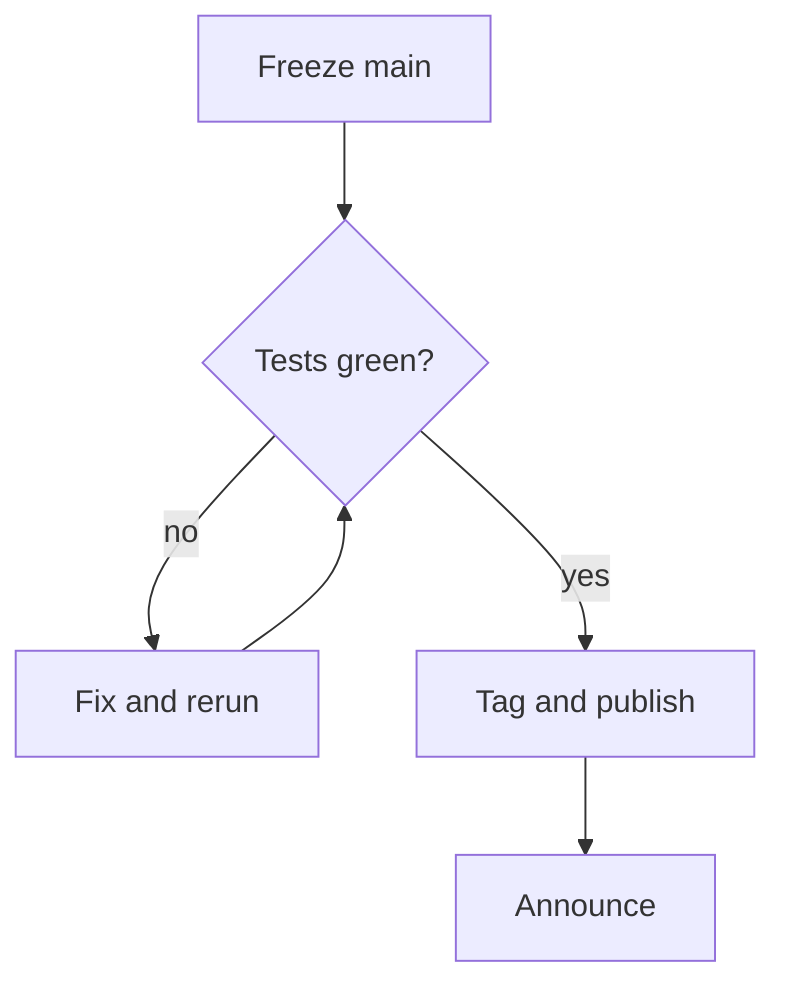

# Release flow

```mermaid
flowchart TD
  A[Freeze main] --> B{Tests green?}
  B -- no --> C[Fix and rerun]
  C --> B
  B -- yes --> D[Tag and publish]
  D --> E[Announce]
```

Each node is a step. Stop at any gate that does not pass and report which one.
